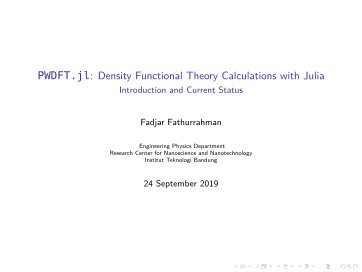

:title: Learning Hovercraft
:data-transition-duration: 1500
:css: PRESE.css

----

----

This is the second slide
========================

Hello I am efefer again.

.. code:: python
    :class: hidden

    import numpy as np
    import matplotlib.pyplot as plt

    x = np.linspace(-5.0, 5.0, 100)
    y = np.sin(x) + np.cos(x)
    plt.plot(x, y)

----

Testing math
============

Inline math: :math:`\alpha + \beta`

Display math:

.. math::

    e^{i \pi} + 1 = 0

    dS = \frac{dQ}{T}

That's good.